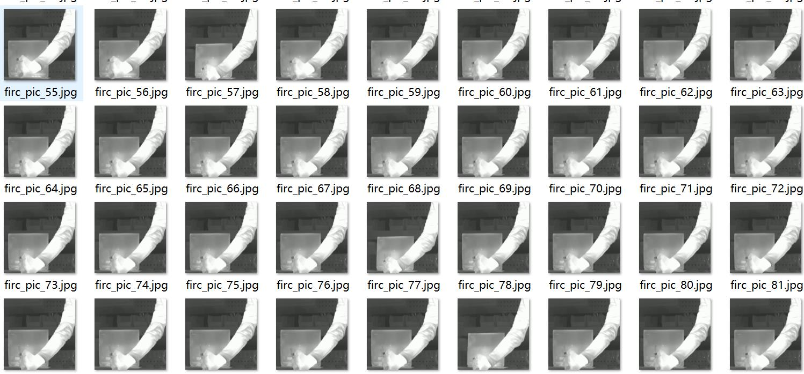
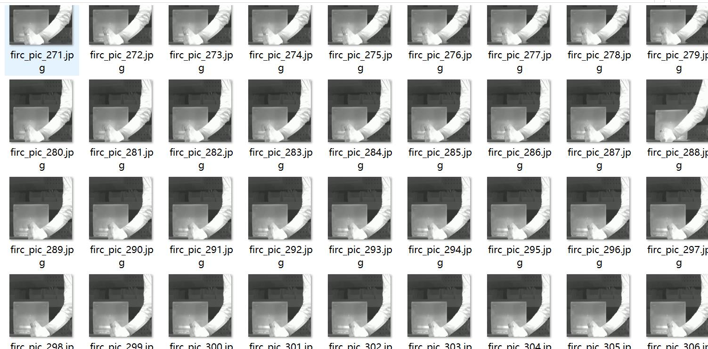
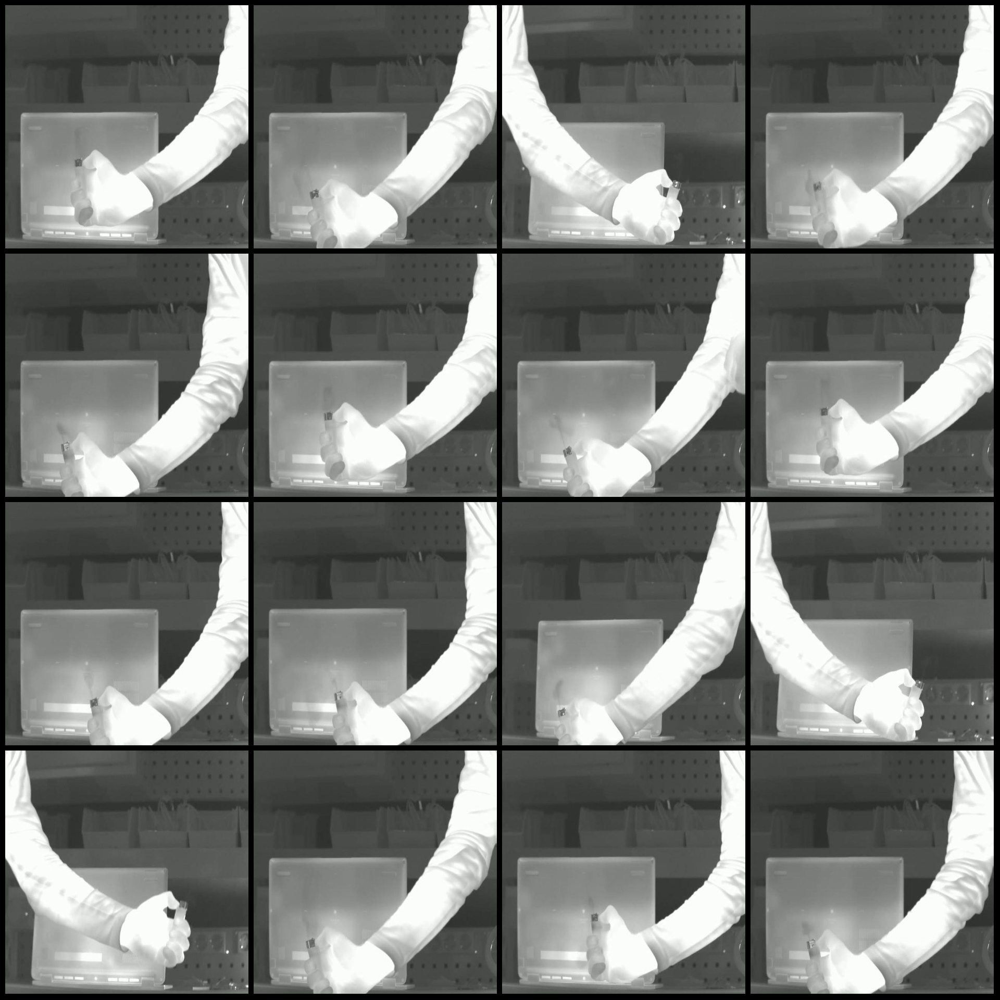
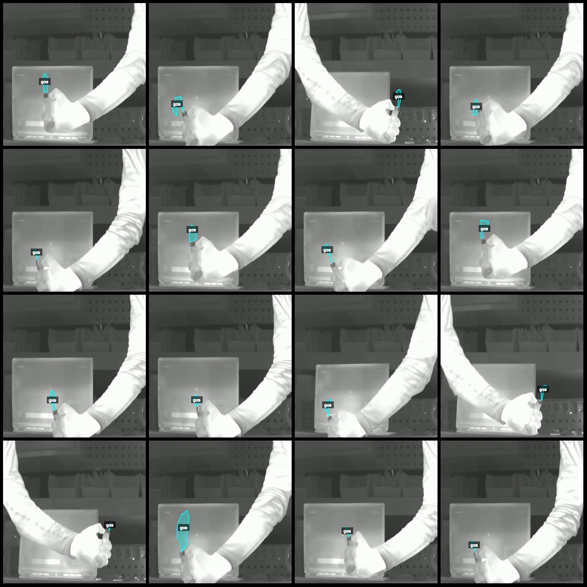
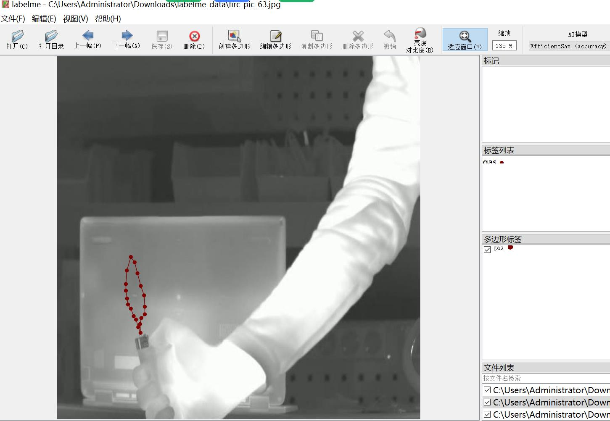

# LabelMe Dataset for Gas Leak Identification of Butane Candles

Dataset format: LabelMe format (excluding maskfile, only including jpgimage and corresponding jsonfile)
number of images: 635  
annotation count: 635  
annotationnumber of classes: 1  
annotation class names:["gas"]  
boxes per class:   
gas count = 643  
total boxes: 643  
Using annotator tool: labelme=5.5.0
Image resolution: 640x640
Annotation rules: Drawing polygons for class boundaries on the image.
Important notes: You can open and edit the dataset with labelme, but the JSON dataset needs to be converted into a format suitable for semantic segmentation or instance segmentation such as mask, yolo, or coco.
Special statement: This dataset does not guarantee any accuracy in the training of the model or weight file.
Image preview:
Annotation example:
The original image (pick 16 randomly):
Annotation drawing result:
LabelMe editing example:
## Images

Here is a pay link on Stripe ( https://buy.stripe.com/3cs8yP7sY87d0vu9AB ). Please contact me lonlonago@foxmail.com after funding $89, and I will send you a complete data files , thank you!

